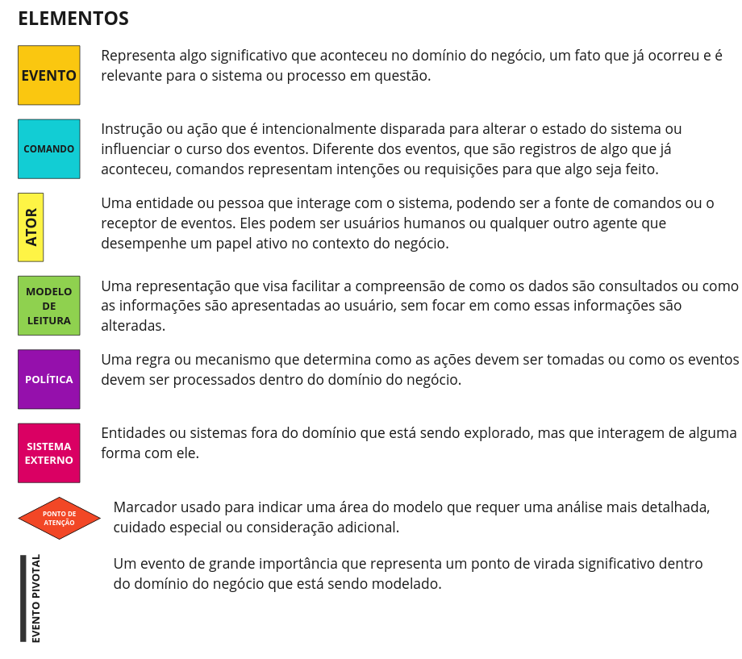
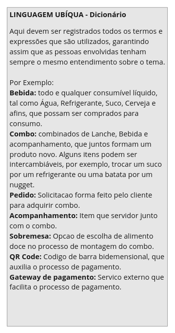
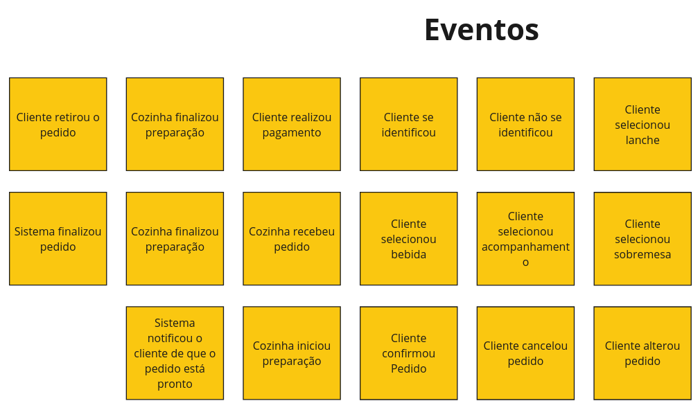

# Fiap Tech Challenge

## Event storming








## Como gerar a  imagem docker da aplicação

1. Usar o comando do maven `mvn clean package -DskipTests` para gerar o arquivo .jar.
2. Comando `docker compose build` para gerar a imagem da aplicação que será utilizada no docker compose.
3. Para subir os containers basta usar o comando `docker compose up -d`.

É possível verificar que a aplicação subiu na porta 8081 com o seguinte curl:

```
curl --location 'http://localhost:8081/api/cozinheiro'
```

> [!NOTE]
> A aplicação do docker vai subir na porta 8081. A aplicação quando sobe localmente sobe na porta 8080.

Usei
este [artigo do medium](https://salithachathuranga94.medium.com/deploy-rest-api-using-spring-boot-mongodb-and-docker-e7ab620b24d6)
como referência para colocar a aplicação num docker.


## Requisitos para rodar a aplicação
1. Instalar o docker 

Exemplo no Linux:

```
curl -fsSL https://get.docker.com -o get-docker.sh
 sudo sh get-docker.sh
```

Documetação oficial para os demais Sistemas operacionais:
> [!NOTE]
> https://docs.docker.com/get-docker/


## Como rodar a aplicação utilizando o docker:
```
docker compose up -d
```
> [!NOTE]
> Nossas Imagens docker estão sendo armazenadas no Docker Hub
> Link do repositório [fiap_tech_challenge](https://hub.docker.com/repository/docker/pedrogimenezsilva/fiap_tech_challenge/general)


## Swagger

A aplicação gera automaticamente um swagger com todos os endpoints disponíveis.

> [!NOTE]
> O swagger é acessado em http://localhost:8081/swagger-ui/index.html