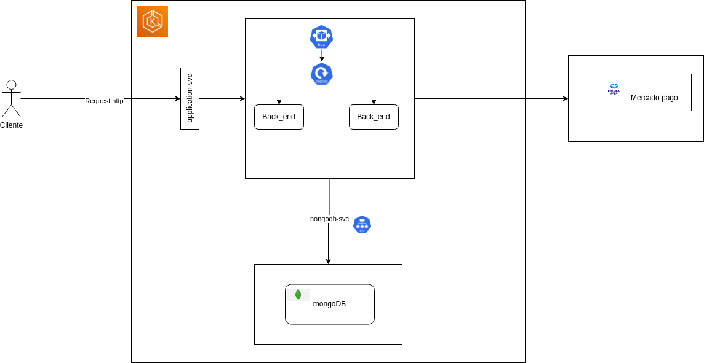
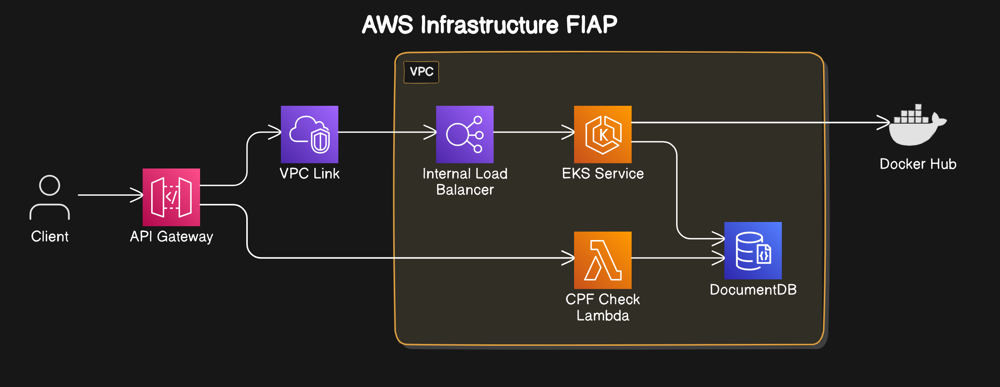

# Fiap Tech Challenge

## Event storming

Link para o [Miro](https://miro.com/app/board/uXjVKWJMoGM=/?share_link_id=84755743046)


## Como gerar a  imagem docker da aplicação

1. Usar o comando do maven `mvn clean package -DskipTests` para gerar o arquivo .jar.
2. Comando `docker compose build` para gerar a imagem da aplicação que será utilizada no docker compose.
3. Para subir os containers basta usar o comando `docker compose up -d`.

É possível verificar que a aplicação subiu na porta 8081 com o seguinte curl:

```
curl --location 'http://localhost:8081/api/cozinheiro'
```

> [!NOTE]
> A aplicação do docker vai subir na porta 8081. A aplicação quando sobe localmente sobe na porta 8080.

Usei
este [artigo do medium](https://salithachathuranga94.medium.com/deploy-rest-api-using-spring-boot-mongodb-and-docker-e7ab620b24d6)
como referência para colocar a aplicação num docker.

## Requisitos para rodar a aplicação

1. Instalar o docker

Exemplo no Linux:

```
curl -fsSL https://get.docker.com -o get-docker.sh
 sudo sh get-docker.sh
```

Documetação oficial para os demais Sistemas operacionais:
> [!NOTE]
> https://docs.docker.com/get-docker/

## Como rodar a aplicação utilizando o docker:

```
docker compose up -d
```

> [!NOTE]
> Nossas Imagens docker estão sendo armazenadas no Docker Hub
> Link do
>
repositório [fiap_tech_challenge](https://hub.docker.com/repository/docker/pedrogimenezsilva/fiap_tech_challenge/general)

## Arquitetura da aplicação



## Swagger

A aplicação gera automaticamente um swagger com todos os endpoints disponíveis.

> [!NOTE]
> O swagger é acessado em http://localhost:8081/swagger-ui/index.html

## Fluxo de pedido

Os endpoints descritos abaixo junto dos endpoints de administração de clientes e produtos se encontram
em: [Collection Postman](https://github.com/flaviohenso/fiap_tech_challenge/blob/develop/Documents/collection/Fiap%20projeto.postman_collection.json)

### Criação de pedido

Criação de um pedido com status inicial ainda não visualizado pela cozinha:

```bash
curl --location 'http://localhost:8080/api/pedidos' \
--header 'Content-Type: application/json' \
--data '{
"clientId": "1",
"combos": [
{
"lanche": {
"idProduto": "1",
"quantity": 1,
"price": 10
},
"acompanhamento": {
"idProduto": "1",
"quantity": 1,
"price": 10
},
"bebida": {
"idProduto": "1",
"quantity": 1,
"price": 10
},
"sobremesa": {
"idProduto": "1",
"quantity": 1,
"price": 10
}
}
]
}'
```

Exemplo de resposta:

```json
{
  "id": "f08d6ed7-d8ca-4869-bc73-c7fed9f8c58c",
  "status": "INICIAL",
  "client_id": "1",
  "combos": [
    {
      "lanche": {
        "id_produto": "1",
        "quantity": 1,
        "price": 10,
        "total_price": 10
      },
      "acompanhamento": {
        "id_produto": "1",
        "quantity": 1,
        "price": 10,
        "total_price": 10
      },
      "bebida": {
        "id_produto": "1",
        "quantity": 1,
        "price": 10,
        "total_price": 10
      },
      "sobremesa": {
        "id_produto": "1",
        "quantity": 1,
        "price": 10,
        "total_price": 10
      },
      "total_price": 40
    }
  ],
  "created_at": "2024-07-30T21:17:30.920029539-03:00",
  "updated_at": "2024-07-30T21:17:30.920029539-03:00",
  "total_price": 40
}
```

### Consulta de pedido

A partir desse momento, usando o id do response acima é possível consultar o pedido por id:

```bash
curl --location 'localhost:8080/api/pedidos/f08d6ed7-d8ca-4869-bc73-c7fed9f8c58c'
```

### Criação de pagamento

O pedido ainda não possui nenhum pagamento atrelado, então é necessário iniciar um pagamento manualmente:

```bash
curl --location 'localhost:8080/api/pagamentos' \
--header 'Content-Type: application/json' \
--data '{
    "pedido_id": "f08d6ed7-d8ca-4869-bc73-c7fed9f8c58c"
}'
```

Exemplo de resposta:

```json
{
  "id": "9051620b-3d3b-44e4-84ca-639e9c5f24af",
  "external_id": "e22a3b74-2ae2-4fa5-b466-6e9c2c16d9a8",
  "pedido_id": "f08d6ed7-d8ca-4869-bc73-c7fed9f8c58c",
  "valor": 40,
  "status": "PENDENTE",
  "pagamento_confirmado_at": null,
  "created_at": "2024-07-30T21:20:03.440026239-03:00",
  "updated_at": "2024-07-30T21:20:03.440026239-03:00"
}
```

Nesse response é possível ver que é gerado um id interno de pagamento e também um external_id que é o id da processadora
de pagamento(no nosso projeto, mercado pago).

### Consulta por pagamento de um pedido

Consultamos o status do pagamento de um pedido usando o endpoint abaixo:

```bash
curl --location 'localhost:8080/api/pedidos/f08d6ed7-d8ca-4869-bc73-c7fed9f8c58c/pagamento'
```

Exemplo de resposta:

```json
{
  "id": "9051620b-3d3b-44e4-84ca-639e9c5f24af",
  "external_id": "e22a3b74-2ae2-4fa5-b466-6e9c2c16d9a8",
  "pedido_id": "f08d6ed7-d8ca-4869-bc73-c7fed9f8c58c",
  "valor": 40,
  "status": "PENDENTE",
  "pagamento_confirmado_at": null,
  "created_at": "2024-07-30T21:20:03.440026239-03:00",
  "updated_at": "2024-07-30T21:20:03.440026239-03:00"
}
```

### Callback pagamento

Recebemos um callback de pagamento concluído da processadora de pagamento no endpoint abaixo. Caso o pagamento tenha
finalizado com sucesso, então pagamento é concluído e o pedido passa para a cozinha ficando com o status recebido.

```bash
curl --location 'localhost:8080/api/pagamentos/callback' \
--header 'Content-Type: application/json' \
--data '{
    "external_id": "e22a3b74-2ae2-4fa5-b466-6e9c2c16d9a8"
}'
```

Exemplo de resposta:

```json
{
  "id": "9051620b-3d3b-44e4-84ca-639e9c5f24af",
  "external_id": "e22a3b74-2ae2-4fa5-b466-6e9c2c16d9a8",
  "pedido_id": "f08d6ed7-d8ca-4869-bc73-c7fed9f8c58c",
  "valor": 40,
  "status": "APROVADO",
  "pagamento_confirmado_at": "2024-07-30T21:26:01.48707987-03:00",
  "created_at": "2024-07-30T21:20:03.440026239-03:00",
  "updated_at": "2024-07-30T21:26:01.48707987-03:00"
}
```

### Consulta de pedidos em aberto

Uma vez que o pagamento é confirmado conseguimos acompanhar os pedidos em aberto com o seguinte endpoint:

```bash
curl --location 'localhost:8080/api/pedidos'
```

Exemplo de resposta:

```json
[
  {
    "id": "f08d6ed7-d8ca-4869-bc73-c7fed9f8c58c",
    "status": "RECEBIDO",
    "client_id": "1",
    "combos": [
      {
        "lanche": {
          "id_produto": "1",
          "quantity": 1,
          "price": 10,
          "total_price": 10
        },
        "acompanhamento": {
          "id_produto": "1",
          "quantity": 1,
          "price": 10,
          "total_price": 10
        },
        "bebida": {
          "id_produto": "1",
          "quantity": 1,
          "price": 10,
          "total_price": 10
        },
        "sobremesa": {
          "id_produto": "1",
          "quantity": 1,
          "price": 10,
          "total_price": 10
        },
        "total_price": 40
      }
    ],
    "created_at": "2024-07-30T21:17:30.920029539-03:00",
    "updated_at": "2024-07-30T21:26:01.491138968-03:00",
    "total_price": 40
  }
]
```

### Atualizando o estado de um pedido

Para acompanhar o histórico de um pedido, a cozinha muda o estado de um pedido para EM_PREPARACAO.

```bash
curl --location --request PATCH 'http://localhost:8080/api/pedidos/f08d6ed7-d8ca-4869-bc73-c7fed9f8c58c' \
--header 'Content-Type: application/json' \
--data '{
    "status": "EM_PREPARACAO"
}'
```

Exemplo de resposta:

```json
{
  "id": "f08d6ed7-d8ca-4869-bc73-c7fed9f8c58c",
  "status": "EM_PREPARACAO",
  "client_id": "1",
  "combos": [
    {
      "lanche": {
        "id_produto": "1",
        "quantity": 1,
        "price": 10,
        "total_price": 10
      },
      "acompanhamento": {
        "id_produto": "1",
        "quantity": 1,
        "price": 10,
        "total_price": 10
      },
      "bebida": {
        "id_produto": "1",
        "quantity": 1,
        "price": 10,
        "total_price": 10
      },
      "sobremesa": {
        "id_produto": "1",
        "quantity": 1,
        "price": 10,
        "total_price": 10
      },
      "total_price": 40
    }
  ],
  "created_at": "2024-07-30T21:17:30.920029539-03:00",
  "updated_at": "2024-07-30T21:30:31.893038369-03:00",
  "total_price": 40
}
```

O mesmo request acima é executado quando a cozinha finaliza o preparo e o cliente retira o pedido, alterando para os
estados PRONTO e FINALIZADO respectivamente. Uma vez vez no estado FINALIZADO, o pedido deixa de aparecer no endpoint de
pedidos aberto. 

### Diagrama da infraestrutura do projeto na AWS

