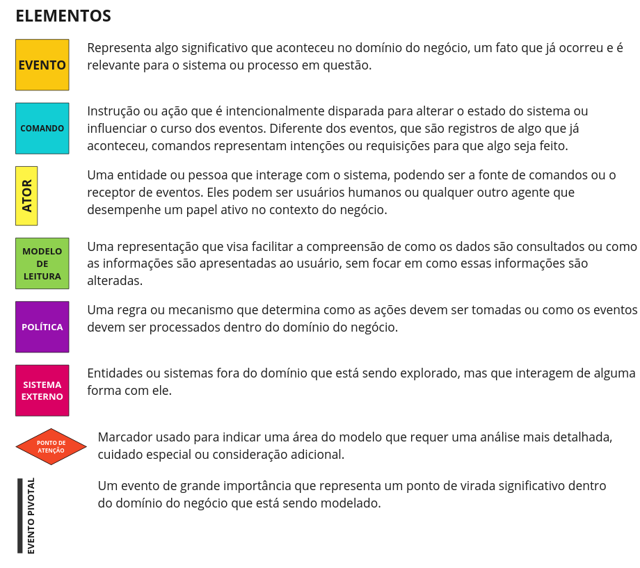
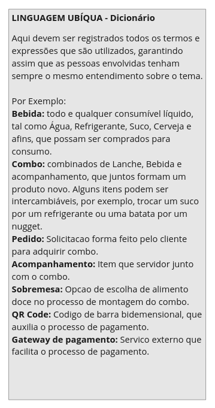
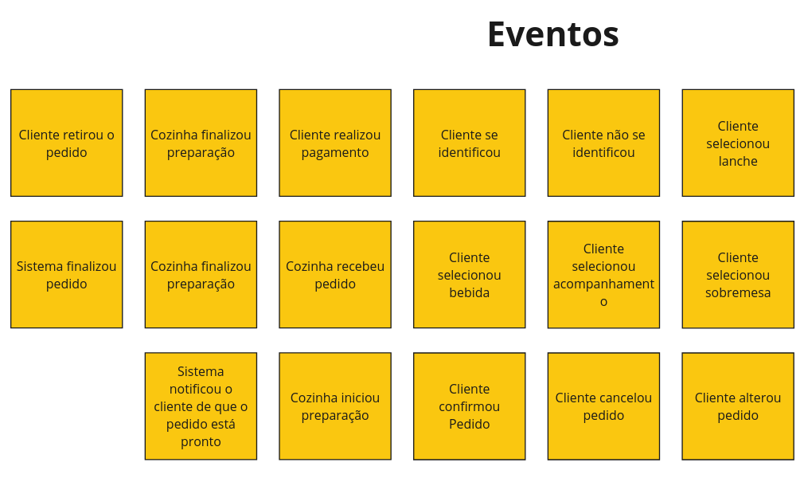

# Fiap Tech Challenge

## Event storming








## Gerar imagem docker da aplicação

1. Usar o comando do maven `mvn clean package -DskipTests` para gerar o arquivo .jar.
2. Comando `docker compose build` para gerar a imagem da aplicação que será utilizada no docker compose.
3. Para subir os containers basta usar o comando `docker compose up -d`.

É possível verificar que a aplicação subiu na porta 8081 com o seguinte curl:

```
curl --location 'http://localhost:8081/api/cozinheiro'
```

> [!NOTE]
> A aplicação do docker vai subir na porta 8081. A aplicação quando sobe localmente sobe na porta 8080.

Usei
este [artigo do medium](https://salithachathuranga94.medium.com/deploy-rest-api-using-spring-boot-mongodb-and-docker-e7ab620b24d6)
como referência para colocar a aplicação num docker.

## Swagger

A aplicação gera automaticamente um swagger com todos os endpoints disponíveis.

> [!NOTE]
> O swagger é acessado em http://localhost:8081/swagger-ui/index.html